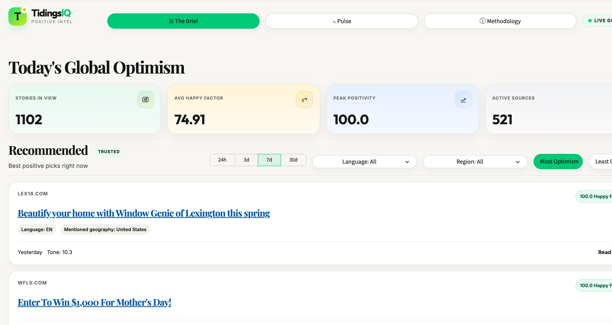
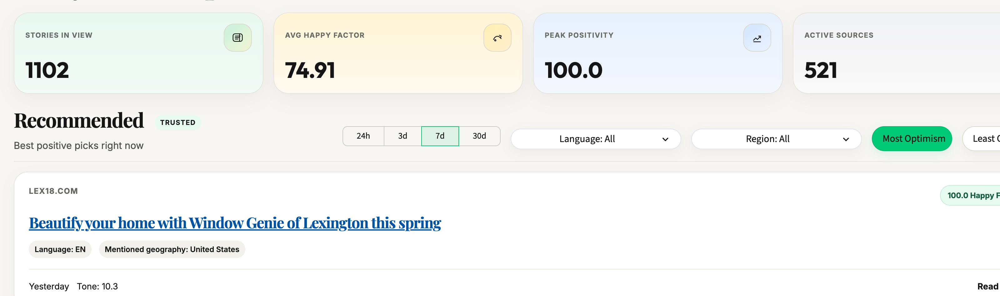
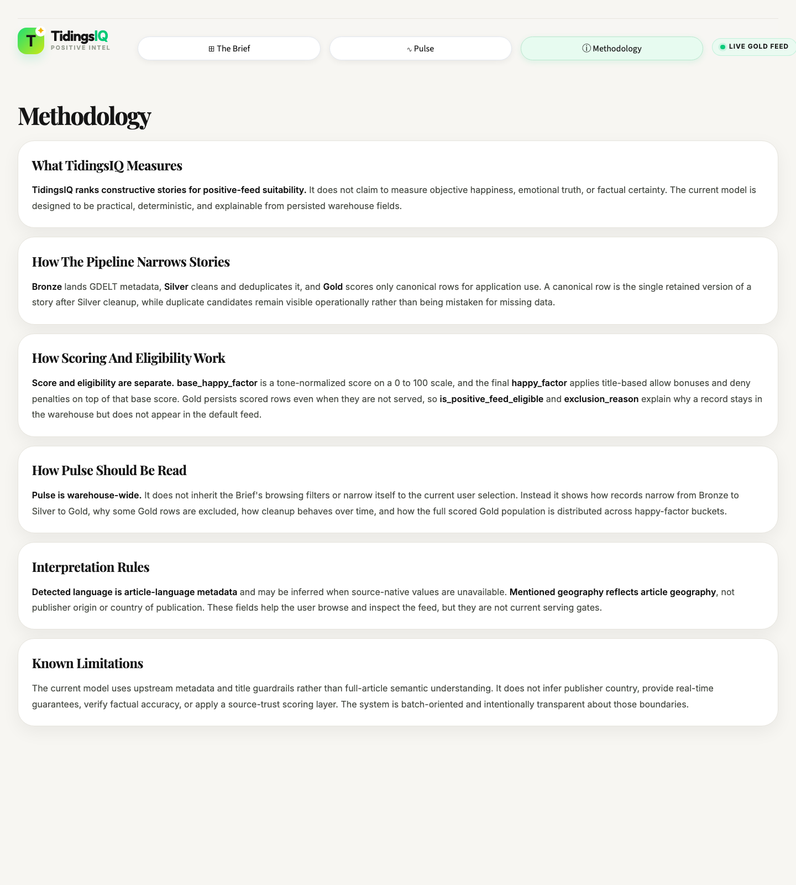
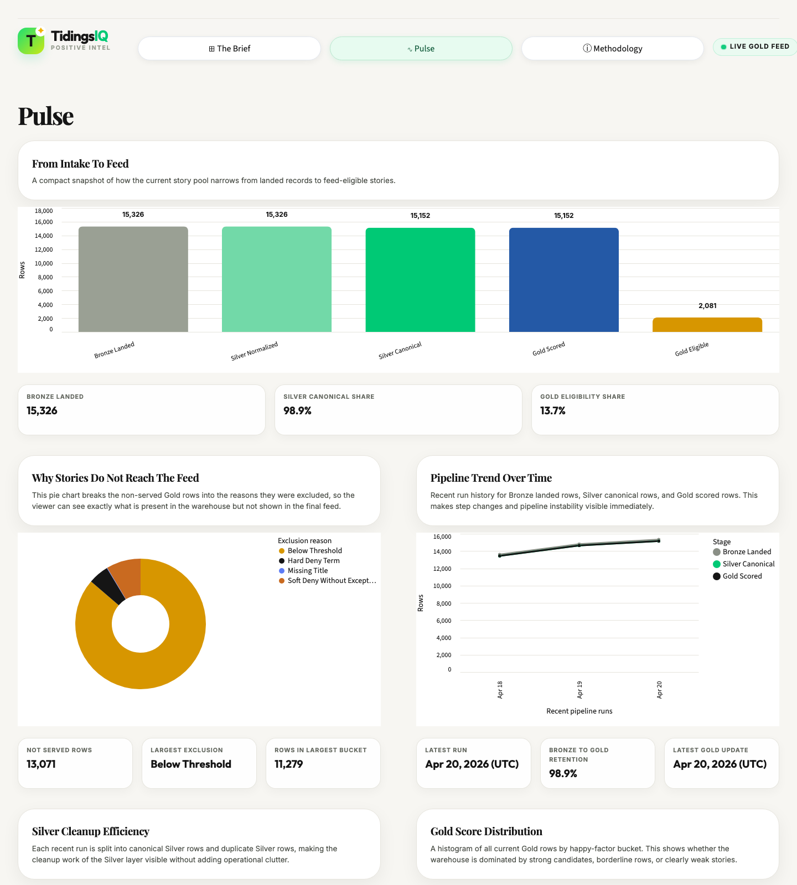

# TidingsIQ: Positive News Intelligence Pipeline

Live dashboard: [https://tidingsiq-app-eglccrtc7q-el.a.run.app/](https://tidingsiq-app-eglccrtc7q-el.a.run.app/)


TidingsIQ is a data engineering project that ingests bounded GDELT news metadata, models it in BigQuery with Bruin, provisions cloud infrastructure with Terraform, and serves a reviewer-accessible positive-news dashboard through Streamlit.

The project focuses on a practical problem: broad news feeds skew toward noise and negative headlines, while many consumers still want a credible way to discover more constructive coverage. TidingsIQ addresses that by building a warehouse-centric pipeline that scores recent articles with an explainable `happy_factor`, applies explicit title guardrails, and publishes the resulting feed through a simple cloud-hosted dashboard.

## Architecture

Data flow:

`GDELT GKG 2.1 -> Bruin Bronze ingestion -> BigQuery bronze -> BigQuery silver -> BigQuery gold -> Streamlit dashboard`

Serving contract:

- canonical serving table: `gold.positive_news_feed`
- default dashboard feed: rows where `is_positive_feed_eligible = true`
- current score version: `happy_factor_version = 'v2_1_guardrailed_tone'`
- current title-rule version: `positive_guardrail_version = 'v1_1_title_rules'`
- current eligibility floor: `happy_factor >= 65`

Warehouse layout:

- `bronze`: landed source records plus ingestion metadata
- `silver`: normalized, deduplicated article rows
- `gold`: scored serving rows and operational metrics
- `bronze_staging` and `gold_staging`: operational merge/staging datasets used by the current load paths

## Stack

- Source: GDELT GKG 2.1
- Cloud: Google Cloud
- Warehouse and compute: BigQuery
- Orchestration and checks: Bruin
- Infrastructure as code: Terraform
- Dashboard: Streamlit on Cloud Run
- Containers: Docker
- Language: Python and SQL

## What Is Implemented

- Terraform-managed datasets, IAM, archive bucket, pipeline automation, reporting resources, and app-hosting path
- Bruin-managed Bronze ingestion, Silver normalization/deduplication, Gold scoring, and warehouse checks
- Retention posture captured in code and docs:
  - Bronze retained 45 days in BigQuery, then archived to GCS
  - Silver retained 90 days in-model
  - Gold retained 180 days in-model
  - archived Bronze objects retained 365 days in GCS
- Public Streamlit dashboard backed only by Gold-layer tables
- Cloud Run deployment path for the pipeline, reporting jobs, and dashboard
- Operational `Pulse` view backed by `gold.pipeline_run_metrics` and Gold summary queries

## Dashboard

Live dashboard: [https://tidingsiq-app-eglccrtc7q-el.a.run.app/](https://tidingsiq-app-eglccrtc7q-el.a.run.app/)

The dashboard exposes three reviewer-relevant surfaces:

- `The Brief`: the application-facing positive-news feed served from eligible Gold rows only
- `Pulse`: warehouse-wide operational visibility for ingestion freshness, row counts, eligibility mix, and score distribution
- `Methodology`: an explainer for the scoring and serving logic

### Product Walkthrough

**The Brief Overview**



**Interface Details**

| Feed Detail | Methodology |
|---|---|
|  |  |

**Pulse**

<p align="center">
  
</p>

The dashboard remains intentionally bounded for a public portfolio deployment:

- fixed lookback windows
- fixed page size
- no unbounded free-form search
- Gold-only reads from the app layer

## Reproducibility

### 1. Provision or validate infrastructure

```bash
cd infra/terraform
cp terraform.tfvars.example terraform.tfvars
terraform init
terraform validate
terraform plan
```

### 2. Configure Bruin locally

Create a local `.bruin.yml` at the repository root and point the default connection at your BigQuery project and location.

Minimal example:

```yaml
default_environment: default
environments:
  default:
    connections:
      google_cloud_platform:
        - name: "bigquery-default"
          project_id: "<GCP_PROJECT_ID>"
          location: "<BIGQUERY_LOCATION>"
          use_application_default_credentials: true
```

### 3. Run the pipeline locally

```bash
bruin validate pipeline/bruin/pipeline.yml
bruin run pipeline/bruin/assets/bronze/gdelt_news_raw.py
bruin run pipeline/bruin/assets/silver/gdelt_news_refined.sql
bruin run pipeline/bruin/assets/gold/positive_feed_guardrail_terms.sql
bruin run pipeline/bruin/assets/gold/positive_news_feed.sql
bruin run pipeline/bruin/assets/gold/pipeline_run_metrics.sql
```

### 4. Run the dashboard locally

```bash
python3 -m pip install -r app/streamlit/requirements.txt
export TIDINGSIQ_GCP_PROJECT=<GCP_PROJECT_ID>
streamlit run app/streamlit/app.py
```

Or with the repository `Makefile`:

```bash
TIDINGSIQ_GCP_PROJECT=<GCP_PROJECT_ID> make streamlit
```

## Repository Structure

```text
.
├── app/streamlit/          # Streamlit dashboard
├── docs/                   # Architecture, scoring, runbook, and roadmap docs
├── infra/terraform/        # GCP infrastructure as code
├── pipeline/bruin/         # Bruin pipeline assets and container path
└── scripts/                # Operational helpers and reporting utilities
```

## Documentation Index

- [Architecture](docs/architecture.md): system boundaries, responsibilities, and runtime flow
- [Data Contract](docs/data_contract.md): Bronze, Silver, Gold, and operational schemas
- [Happy Factor](docs/happy_factor.md): current scoring and feed-eligibility logic
- [GDELT Findings](docs/gdelt_findings.md): upstream field-mapping evidence and source findings
- [Bruin Pipeline](pipeline/bruin/README.md): local setup, asset behavior, validation, and container path
- [Streamlit App](app/streamlit/README.md): dashboard behavior, local run instructions, and Gold query contract
- [Terraform Foundation](infra/terraform/README.md): provisioned GCP resources and variables
- [Operations Scripts](scripts/README.md): archive, reporting, and warehouse-reset helpers
- [Operations Runbook](docs/operations_runbook.md): smoke tests, scheduler operations, and deployment debugging
- [Roadmap](docs/roadmap.md): current state, deployment posture, and remaining work
- [Deployment Plan](docs/deployment_plan.md): cloud runtime posture for pipeline and dashboard

## Current Deployment Posture

- The public dashboard is live on Cloud Run at the URL linked above.
- The pipeline Cloud Run Job path, reporting job path, and app-hosting path are implemented in the repository.
- The current public app posture is direct public Cloud Run serving on the `run.app` URL rather than a load-balancer-hardened edge.
- The optional AppEdge hardening path remains available in Terraform for future traffic or branding needs.

## Known Limitations

- The scoring model is explainable and deterministic, but it is not a claim of full-article sentiment understanding or factual verification.
- `TranslationInfo` remains sparse in sampled GDELT rows, so language metadata is still native-first with deterministic inference as fallback and remains informational rather than a serving gate.
- The Bronze archive path is implemented, but repeated export-only operation should remain transitional until a persisted archival boundary is introduced.
- The dashboard currently favors bounded, reviewer-friendly browsing over a richer search experience.

## Submission Notes

- This repository is documented to be reviewable from the root README first.
- The canonical serving table is `gold.positive_news_feed`.
- The public dashboard and the GitHub repository website field should point to the same live URL.
- Supporting docs are kept aligned to current implementation state; future work is called out explicitly rather than mixed into current-state sections.
