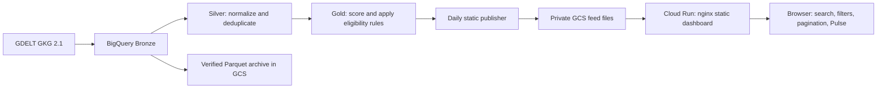
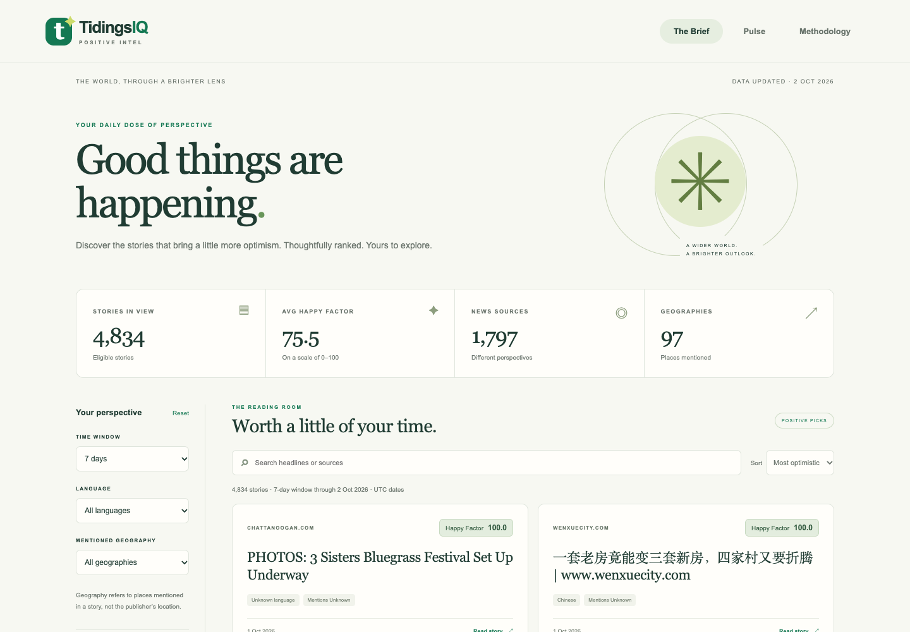
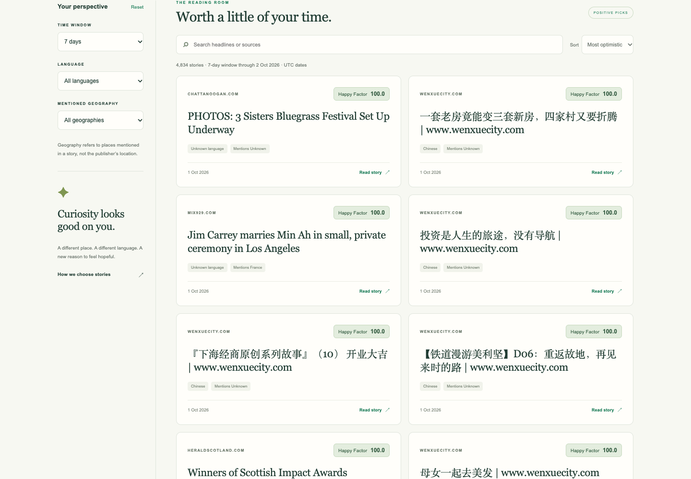
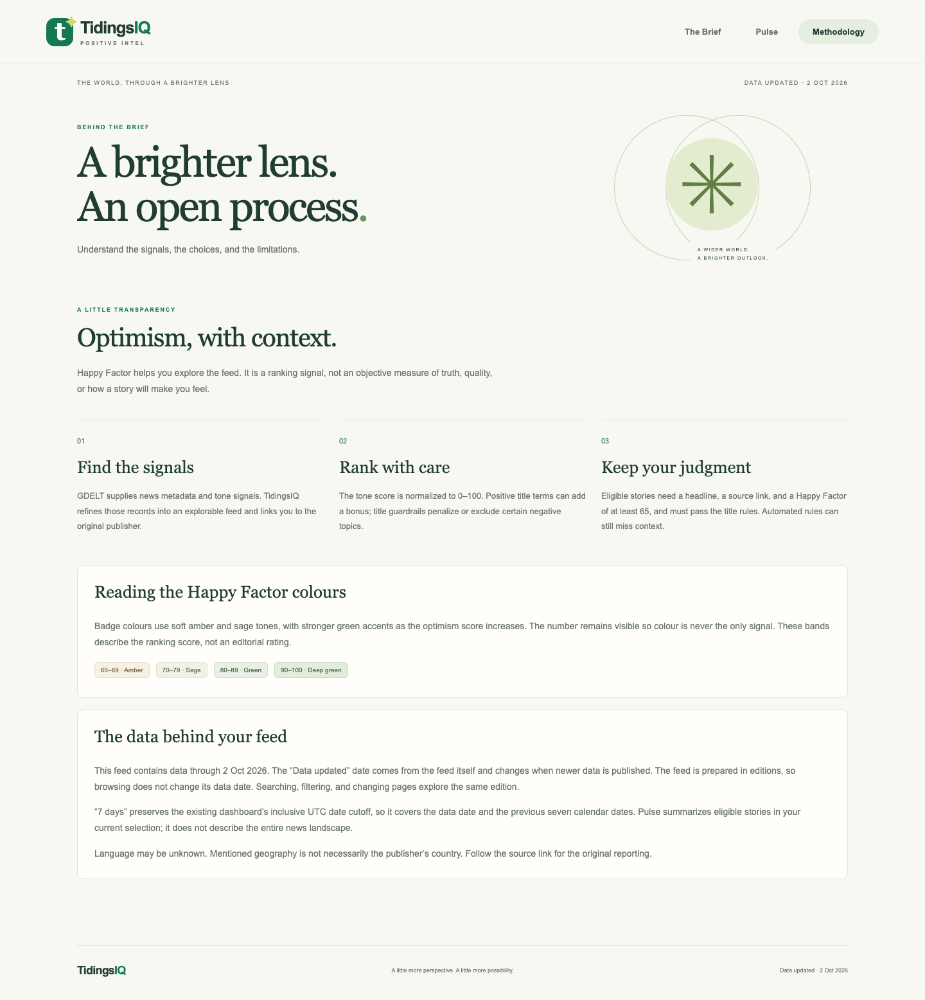
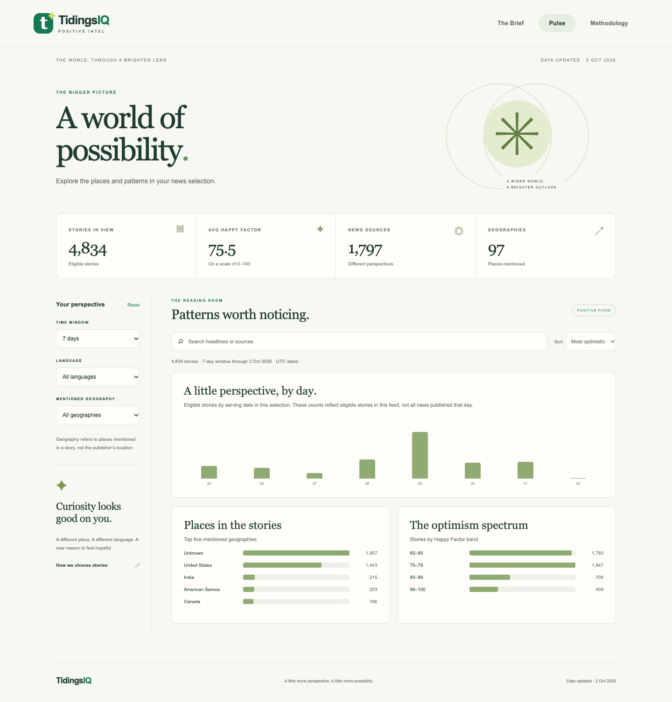
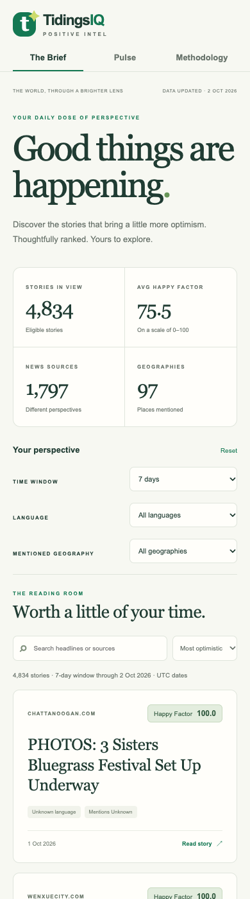

# TidingsIQ: Positive News Intelligence Pipeline

Live dashboard: [TidingsIQ](https://tidingsiq-app-eglccrtc7q-el.a.run.app/)


TidingsIQ ingests bounded GDELT news metadata, models it in BigQuery with Bruin,
and publishes a daily positive-news feed through a static dashboard. Terraform
manages the cloud infrastructure. Visitors can search, filter, and explore the
published edition without triggering warehouse queries.

The project makes constructive coverage easier to discover with an explainable
`happy_factor` and explicit title guardrails. Scores are ranking signals, not
editorial endorsements or verification of the linked reporting.

## Architecture


```mermaid
flowchart LR
    GDELT["GDELT GKG 2.1"] --> Bronze["BigQuery Bronze"]
    Bronze --> Silver["Silver: normalize and deduplicate"]
    Silver --> Gold["Gold: score and apply eligibility rules"]
    Gold --> Publisher["Daily static publisher"]
    Publisher --> GCS["Private GCS feed files"]
    GCS --> Web["Cloud Run: nginx static dashboard"]
    Web --> Browser["Browser: search, filters, pagination, Pulse"]
    Bronze --> Archive["Verified Parquet archive in GCS"]
```

Bruin runs ingestion and transformations in a scheduled Cloud Run Job. The
publisher is a separate job; the public frontend has read-only feed-bucket access
and no warehouse query path. See [Architecture](docs/architecture.md).

Serving contract:

- canonical warehouse table: `gold.positive_news_feed`
- publisher selects only `is_positive_feed_eligible = true`
- score version: `v2_1_guardrailed_tone`; title rules: `v1_1_title_rules`
- eligibility floor: `happy_factor >= 65`
- published files retain all eligible variants with a derived `story_id`
- browser filters run before selecting one representative per story
- public payload contains 11 approved source fields plus `story_id`

## Stack

| Responsibility | Implementation |
|---|---|
| Source | GDELT GKG 2.1 metadata |
| Warehouse and transformations | BigQuery, Python, SQL |
| Pipeline orchestration and checks | Bruin |
| Infrastructure | Terraform on Google Cloud |
| Scheduled compute | Cloud Run Jobs and Cloud Scheduler |
| Public dashboard | HTML/CSS/JavaScript, nginx on Cloud Run |
| Data delivery | Private GCS bucket, content-hashed JSON and gzip |

## What Is Implemented

- Bounded ingestion with source-attempt tracking, retries, and completeness checks
- Silver normalization and URL-first deduplication; Gold scoring and title rules
- Daily publication with pipeline-success and freshness checks, verified uploads,
  and atomic manifest replacement
- Request-based frontend billing, zero minimum instances, maximum two instances
- Checkpointed Bronze archival after 45 days, with verified and capped pruning
  outside the 90-day serving horizon; archived objects retained for 365 days
- Silver's 90-day and Gold's 180-day model cutoffs; Gold availability also depends
  on the upstream Silver horizon, so 180 days is not guaranteed history
- Separate pipeline reports and failure alerts; operational metrics remain in Gold

## Dashboard

- **The Brief:** eligible, deduplicated stories with date/language/geography
  filters, headline/source search, score sorting, and ten-card pages.
- **Pulse:** daily counts, geographies, and score bands for the **current filtered
  public feed**. It is not the former warehouse-wide operational dashboard.
- **Methodology:** scoring, eligibility, score colours, date semantics, and limits.

### Product Walkthrough

Screenshots captured from production on **2 October 2026**, using that day's
published edition. Story counts and content change with each successful publication.

**The Brief Overview**



**Interface Details**

| Feed Detail | Methodology |
|---|---|
|  |  |

**Pulse**

<p align="center">
  
</p>

**Mobile**

<p align="center">
  
</p>

See [screenshot provenance](docs/screenshots/README.md) for capture settings.

The default 7-day range loads first; 30 days loads only when selected. Dates use
an inclusive UTC cutoff: “7 days” covers the edition date and seven preceding
calendar dates. Open tabs keep their loaded edition until refreshed. No polling,
WebSockets, external fonts, or third-party scripts are used.

## Reproducibility

### 1. Run the static dashboard locally

Follow the [static dashboard guide](app/static/README.md) to download the already
public feed or build one from an eligible export, then run:

```bash
python3 app/static/serve.py
```

Open <http://127.0.0.1:4173>. The local server requires no Google credentials.

### 2. Provision or validate infrastructure

```bash
cd infra/terraform
cp terraform.tfvars.example terraform.tfvars
terraform init
terraform validate
terraform plan
```

Fill the placeholders before planning. Review the plan; a plan is not a deploy.
Keep credentials, local variables, and Terraform state out of Git. See the
[Terraform guide](infra/terraform/README.md) and [deployment guide](docs/deployment_plan.md).

### 3. Configure and run Bruin

Create a local, ignored `.bruin.yml` with a `bigquery-default` connection using
application default credentials, your project, and BigQuery location. Then:

```bash
bruin validate pipeline/bruin/pipeline.yml
bruin run pipeline/bruin/pipeline.yml
```

These commands use the warehouse and can incur costs. The [pipeline guide](pipeline/bruin/README.md)
documents configuration, individual assets, bounded source windows, and checks.
The [legacy Streamlit app](app/streamlit/README.md) is retained for development;
it is not the public production frontend.

## Repository Structure

```text
.
├── app/static/             # Public frontend, feed builder, local server, tests
├── app/streamlit/          # Legacy warehouse-backed app
├── docs/                   # Maintained guides, screenshots, dated history
├── infra/terraform/        # Datasets, IAM, jobs, schedules, hosting
├── pipeline/bruin/         # Ingestion, SQL models, checks, container
└── scripts/                # Publisher, archive, reporting, repair helpers
```

## Documentation Index

Start with the [documentation map](docs/README.md).

- [Architecture](docs/architecture.md): components, data flow, retention, boundaries
- [Data Contract](docs/data_contract.md): warehouse fields and public export contract
- [Happy Factor](docs/happy_factor.md): formula, title rules, interpretation limits
- [Static Dashboard](app/static/README.md): local setup, behavior, build isolation
- [Deployment](docs/deployment_plan.md): current schedules, release steps, verification
- [Operations Runbook](docs/operations_runbook.md): recovery, publishing, archival, shutdown
- [IAM](docs/iam_minimum_roles.md): separate runtime identities and scoped access
- [Roadmap](docs/roadmap.md): completed work and actual remaining work
- [Historical Evidence](docs/history/README.md): incident, sizing, rollout, and cost estimates

## Current Deployment Posture

Live state verified **2 October 2026** in `tidingsiq-dev`, `asia-south1`:

| Workload | Schedule, Asia/Kolkata | State |
|---|---|---|
| Pipeline | Daily 06:00 | Enabled; October 2 execution succeeded |
| Report | Daily 06:20 | Enabled; October 2 execution succeeded |
| Static publisher | Daily 06:30 | Enabled; October 1 and 2 executions succeeded |
| Bronze archive | Daily 03:15 and 15:15 | Enabled; latest inspected execution succeeded |

The public endpoint is direct Cloud Run; no load balancer/CDN/Cloud Armor is active.
Restricted egress is disabled. Optional networking and edge modules remain in code.
The [dated billing estimate](docs/history/static_dashboard_cost_estimate_20260930.md)
contains assumptions, not a current invoice or guaranteed spending cap.

## Known Limitations

- Metadata and title rules do not establish factual accuracy or full-article sentiment.
- Language can be unknown; mentioned geography is not publisher country.
- Headline, URL, syndication and bounded fuzzy matching can miss rewrites or merge
  similar headlines; it does not establish article-body equivalence.
- The complete selected range occupies browser memory, though only ten cards render.
- Failed publishing retains the last good edition; a stale-data notice appears
  after 36 hours. Live feed files have no automatic age expiry, so storage grows
  until unreferenced editions are safely cleaned up.
- Public traffic still incurs transfer/compute costs. Instance limits are not a rupee cap.
