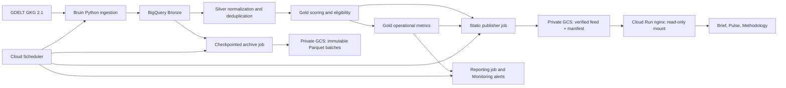

# TidingsIQ Architecture

## Purpose

TidingsIQ is a batch ELT system for constructive-news discovery. BigQuery owns
normalization, scoring, eligibility, and operational metrics. A separate publisher
creates public feed files; visitor interactions operate on those files in the
browser. This separation keeps public browsing independent of warehouse scans.

Current runtime configuration was checked on **2 October 2026**. Dated rollout
and incident evidence is kept in [history](history/README.md).

## High-Level Diagram

Terraform provisions datasets, identities, buckets, containers' hosting resources,
schedules, and alerts. Bruin runs the asset graph inside the pipeline job.

## Component Responsibilities

### Source and ingestion

The pipeline reads a bounded set of GDELT GKG 15-minute exports over HTTPS.
Manifest selection, publication lag, retries, and per-file outcomes are recorded
so an incomplete source window is distinguishable from low news volume. Historical
repairs are explicit bounded operations; they do not redefine live completeness.
See [source findings](gdelt_findings.md) and the [pipeline guide](../pipeline/bruin/README.md).

### Warehouse

| Layer | Responsibility |
|---|---|
| Bronze | Preserve source records, ingestion IDs, and source-attempt history |
| Silver | Normalize metadata; URL-first canonicalization and deterministic tie breaks |
| Gold | Guardrailed Happy Factor, eligibility, exclusion reasons, operational metrics |
| Staging datasets | Operational merge/load support, not public serving data |

`gold.positive_news_feed` is the canonical scored contract. It includes excluded
rows for auditability; the publisher reads only eligible rows. The active score
is `v2_1_guardrailed_tone`, with `v1_1_title_rules` and a floor of 65. The v3 shadow
model remains separate and is not promoted by the static rollout.

### Static publisher

`scripts/publish_static_feed.py` runs once daily after pipeline/report schedules.
It requires the latest Cloud Run pipeline execution to have succeeded and the
metrics audit timestamp to fall inside that execution. It rechecks the execution
before manifest replacement, rejecting a changed or unsuccessful run. It also
validates recent metrics, Gold ingestion freshness, source completeness, and
low-volume streaks before exporting 11 approved source fields. The builder adds
`story_id` to each public record. Each query has a
500 MB maximum billed-byte setting.

The builder assigns story IDs across the full 30-day edition using normalized
headlines, URL identity, dated syndication identities, corroborating slugs and
bounded fuzzy matching within a language. All eligible variants remain in both
range files. Browser filters run before selecting the highest-score/newest/ID
representative; cards, counts and Pulse use those representatives. Warehouse rows
and eligibility remain unchanged. See [matching rules and limitations](durable_story_deduplication.md).

The job creates hashed 7-day and 30-day JSON/gzip files, checks uploaded bytes,
and replaces `manifest.json` last using a GCS generation precondition. Failed or
stale runs retain the previous edition; overlapping older runs cannot overwrite
a newer successful manifest. Date labels come from ingestion metadata, not a
hardcoded date or a requirement for today's article publication dates.

### Public frontend

nginx serves six allowlisted assets plus versioned feed routes. Its service
identity can read only the feed bucket through the provisioned static-reader
binding; the volume is read-only. The frontend contains no BigQuery client,
credentials, local fixtures, Python helpers, or development server.

The browser loads the 7-day file first and fetches 30 days only on selection.
Search, filters, score sorting, pagination, and Pulse are local operations. Pulse
summarizes the current eligible selection, not warehouse-wide health. Operational
health stays in the reporting/Monitoring path. No polling or WebSockets keep an
idle page active; an open page loads a new edition on refresh.

The service uses request-based billing, minimum zero, maximum two, 1 vCPU and
512 MiB. Feed responses use gzip and immutable cache headers; the manifest has a
60-second cache lifetime. GCS mount caching can add brief publication visibility
lag. A loaded edition older than 36 hours produces a visible notice.

### Reporting and archival

Reporting reads Gold summaries and emits `DAILY_PIPELINE_SUMMARY` for Monitoring.
The archive worker is `scripts/archive_bronze_incremental.py`: a conditional GCS
lock, persisted checkpoint, immutable batch paths, full-row Parquet verification,
and guarded pruning prevent repeated full-history exports and premature deletion.
The older `archive_bronze.py` is reserved for explicitly scoped recovery exports.

## Retention and Boundaries

| Data | Current policy |
|---|---|
| Bronze | Export after 45 days; retain at least 90 days before verified, checkpoint-covered pruning outside both ingestion/publication horizons |
| Silver | Model filters to 90 days using publication time with ingestion fallback |
| Gold | Model cutoff is 180 days; upstream Silver's horizon limits available history |
| Bronze archive objects | Lifecycle expiry after 365 days |
| Static feed objects | Live hashed files have no age expiry; private audits expire after 45 days; archived versions are removed after seven newer versions |

Pruning is capped per execution, so retained Bronze can exceed the target horizon
while a backlog is processed. No unverified rows are deleted to force a deadline.
See the [operations runbook](operations_runbook.md) for rollback and lock recovery.

## Current Cadence

All schedules use `Asia/Kolkata`: pipeline 06:00, report 06:20, publisher 06:30,
archive 03:15 and 15:15. These are independent schedules, not a transactional
workflow; the publisher's freshness/completeness checks protect publication if
upstream work runs late or fails. Live schedule state is a dated observation,
not the Terraform default for a new environment.

## Scope and Limits

The system does not perform full-article fact checking, semantic clustering,
stream processing, or multi-tenant access control. The dashboard is publicly
readable; BigQuery and the feed bucket are not made public by that choice.
The original Streamlit app remains in source as a legacy tool and receives no
production traffic. Optional edge/restricted-egress infrastructure is disabled.
